---
## Front matter
lang: ru-RU
title: Лобараторная работа 1
author:
  - Абдуллахи Абдул Вахид
institute:
  - Российский университет дружбы народов, Москва, Россия
  - Группа НПИбд-03-23
date: 02 марта 2024

## i18n babel
babel-lang: russian
babel-otherlangs: english

## Fonts
mainfont: PT Serif
romanfont: PT Serif
sansfont: PT Sans
monofont: PT Mono
mainfontoptions: Ligatures=TeX
romanfontoptions: Ligatures=TeX
sansfontoptions: Ligatures=TeX,Scale=MatchLowercase
monofontoptions: Scale=MatchLowercase,Scale=0.9

## Formatting pdf
toc: false
toc-title: Содержание
slide_level: 2
aspectratio: 169
section-titles: true
theme: metropolis
header-includes:
 - \metroset{progressbar=frametitle,sectionpage=progressbar,numbering=fraction}
 - '\makeatletter'
 - '\beamer@ignorenonframefalse'
 - '\makeatother'
---

## Цель работы

 - Целью данной работы является приобретение практических навыков установки операционной системы на виртуальную машину, настройки минимально необходимых для дальнейшей работы сервисов.

## Задание

 - я уже в прошлом семестре установил virtualbox поэтому мне не надо было.
 
## следующим шагом нужно скачать Linux fedora sway.

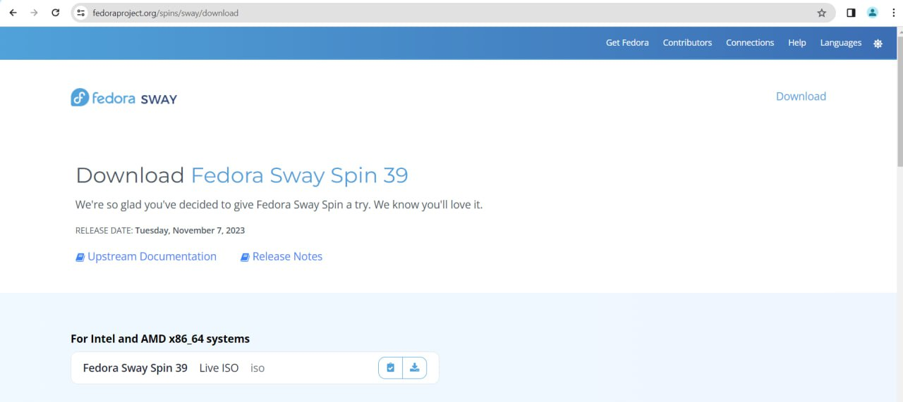

## далее требуется выполнить установку Linux fedora sway на виртуальную машину:

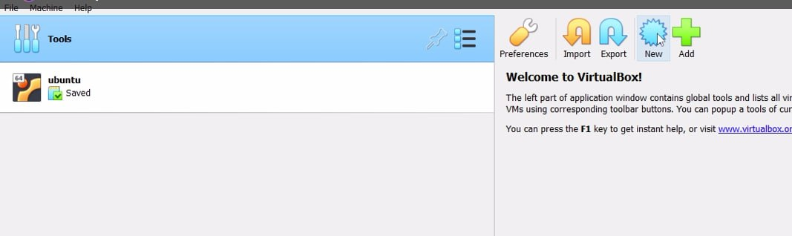

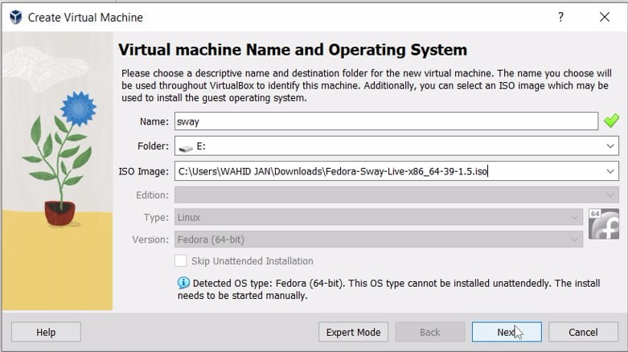

## нужно указать обЪем памяти и я указал 16384 мб

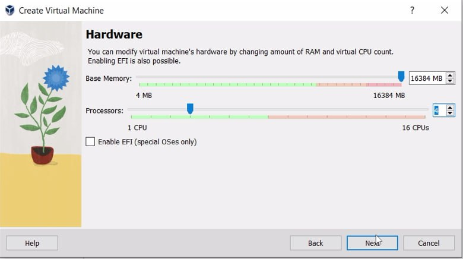

## меняем значение размер виртуального жёсткого диска на 80 гб

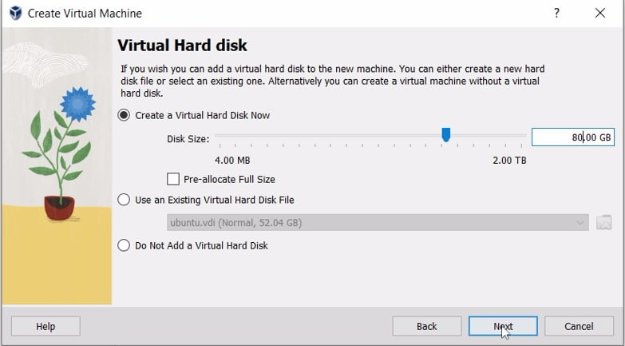

## теперь надо открыть настройку и менять настройку display и надо выбрать 3d:

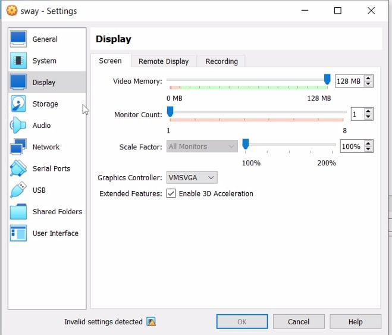

## теперь всё готово и надо запустить виртуальную машину:

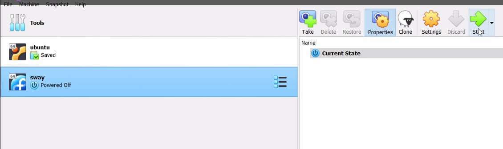

## чтобы начать установить федору, надо нажать на клавишу ctrl+d открывается экрачн и надо написать liveinst:

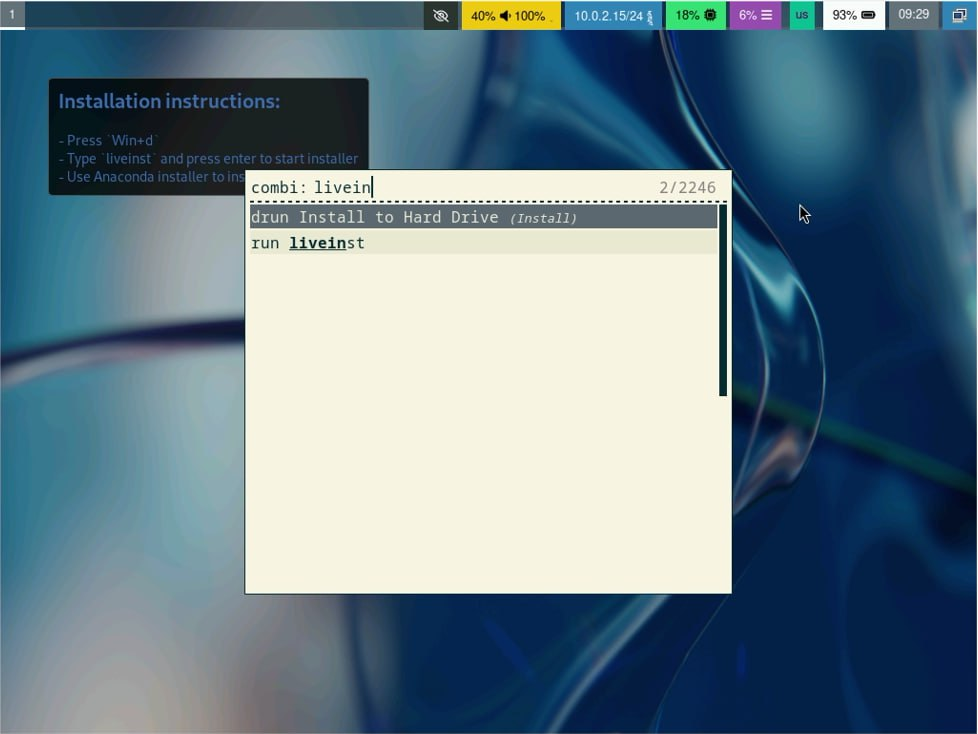

## после окончания установки надо завершить работу

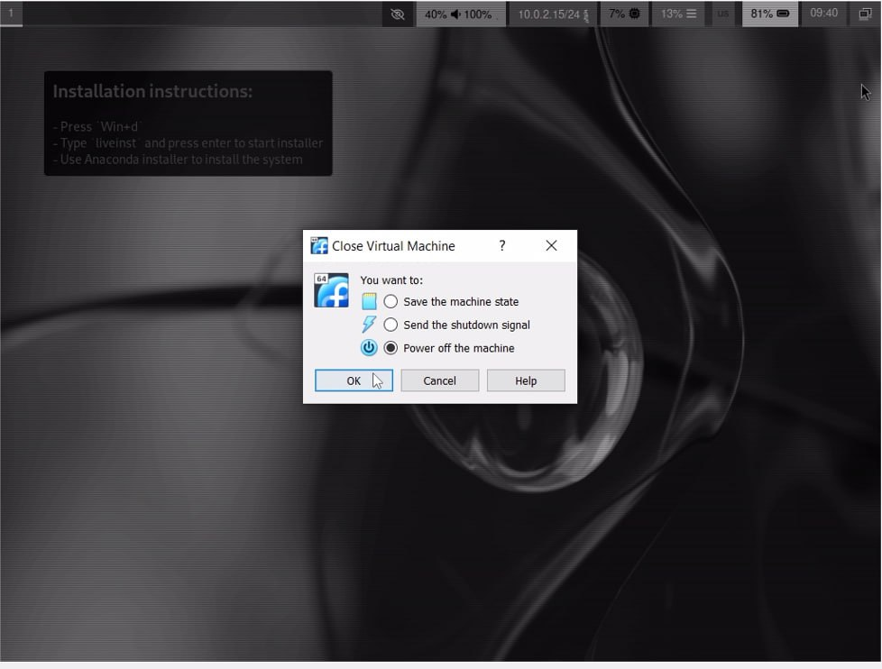

## теперь в пункте "носители" нужно изъять диск с привода 

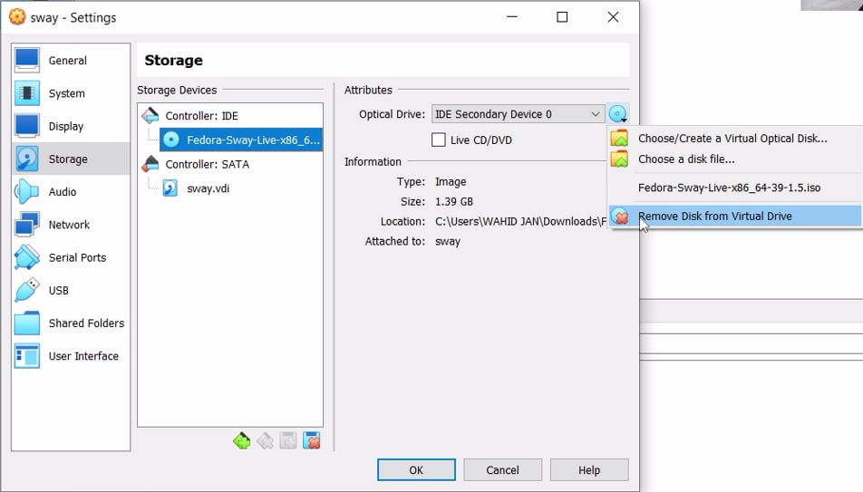

# Домашнее задание

## 1: Версия ядра Linux (Linux version)

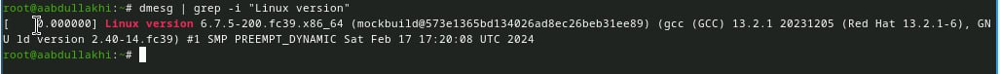

## 2: Частота процессора (Detected Mhz processor)

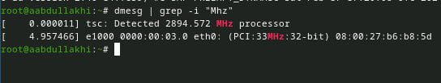

## 3: Модель процессора (CPU0)

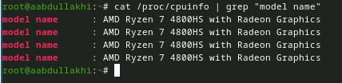

## 4: Объём доступной оперативной памяти (Memory available)

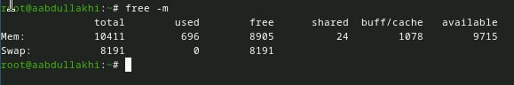

## 5: Тип обнаруженного гипервизора (Hypervisor detected)

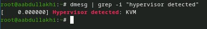

## 6: Тип файловой системы корневого раздела 

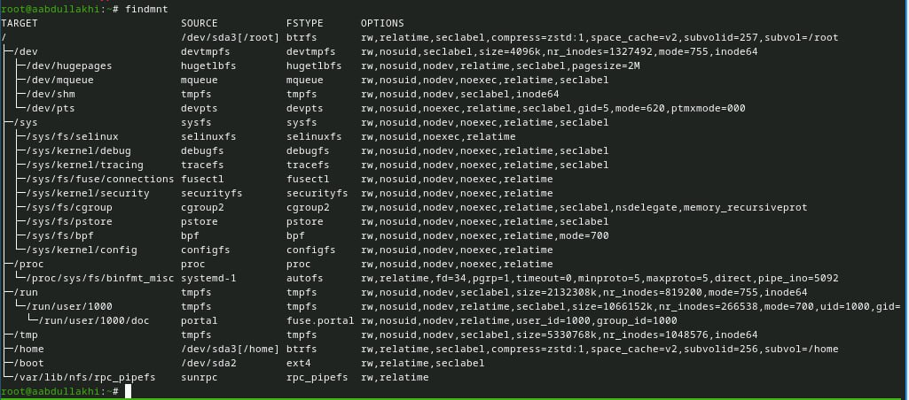

## 7: последовательност монтирования файловых систем:

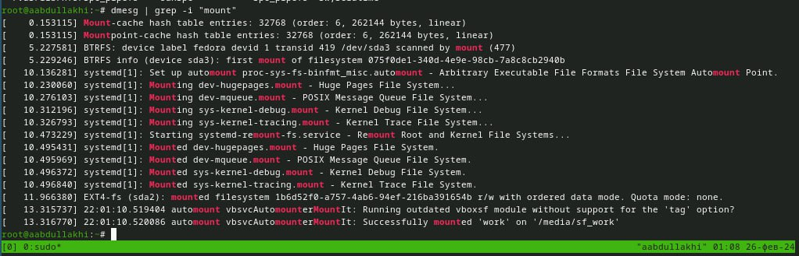

# Спасибо за внимание 

:::

