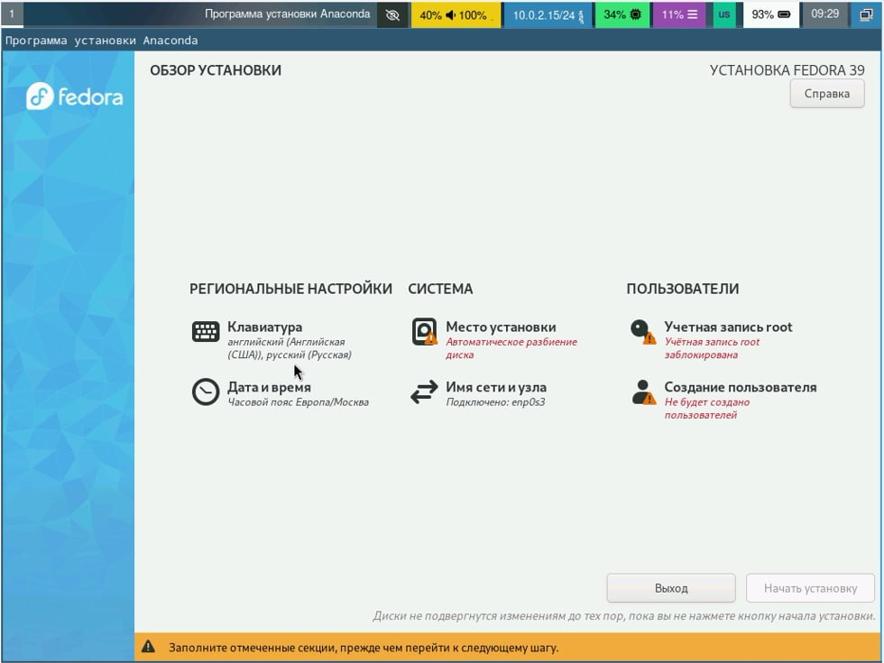

---
## Front matter
title: "шаблон отчёта по лабораторной работе 1"
subtitle: "Простейший вариант"
author: "Абдуллахи Абдул Вахид"

## Generic otions
lang: ru-RU
toc-title: "Содержание"

## Bibliography
bibliography: bib/cite.bib
csl: pandoc/csl/gost-r-7-0-5-2008-numeric.csl

## Pdf output format
toc: true # Table of contents
toc-depth: 2
lof: true # List of figures
lot: true # List of tables
fontsize: 12pt
linestretch: 1.5
papersize: a4
documentclass: scrreprt
## I18n polyglossia
polyglossia-lang:
  name: russian
  options:
	- spelling=modern
	- babelshorthands=true
polyglossia-otherlangs:
  name: english
## I18n babel
babel-lang: russian
babel-otherlangs: english
## Fonts
mainfont: PT Serif
romanfont: PT Serif
sansfont: PT Sans
monofont: PT Mono
mainfontoptions: Ligatures=TeX
romanfontoptions: Ligatures=TeX
sansfontoptions: Ligatures=TeX,Scale=MatchLowercase
monofontoptions: Scale=MatchLowercase,Scale=0.9
## Biblatex
biblatex: true
biblio-style: "gost-numeric"
biblatexoptions:
  - parentracker=true
  - backend=biber
  - hyperref=auto
  - language=auto
  - autolang=other*
  - citestyle=gost-numeric
## Pandoc-crossref LaTeX customization
figureTitle: "Рис."
tableTitle: "Таблица"
listingTitle: "Листинг"
lofTitle: "Список иллюстраций"
lotTitle: "Список таблиц"
lolTitle: "Листинги"
## Misc options
indent: true
header-includes:
  - \usepackage{indentfirst}
  - \usepackage{float} # keep figures where there are in the text
  - \floatplacement{figure}{H} # keep figures where there are in the text
---

# Цель работы

Целью данной работы является приобретение практических навыков установки операционной системы на виртуальную машину, настройки минимально необходимых для дальнейшей работы сервисов.

# Задание
я уже в прошлом семестре установил virtualbox поэтому мне не надо было.

следующим шагом нужно скачать Linux fedora sway.
https://fedoraproject.org/spins/sway/download/index.html

{#fig:001 width=100%}

далее требуется выполнить установку Linux fedora sway на виртуальную машину:

{#fig:001 width=100%}

{#fig:001 width=100%}

нужно указать обЪем памяти и я указал 16384 мб

{#fig:001 width=100%}

меняем значение размер виртуального жёсткого диска на 80 гб

{#fig:001 width=100%}

теперь надо открыть настройку и менять настройку display и надо выбрать 3d:

{#fig:001 width=100%}

{#fig:001 width=100%}

теперь всё готово и надо запустить виртуальную машину:

{#fig:001 width=100%}

я запустил виртуальную машину через Troubleshooting:

{#fig:001 width=100%}

машина запускался:

{#fig:001 width=100%}

чтобы начать установить федору, надо нажать на клавишу ctrl+d открывается экран и надо написать liveinst:

{#fig:001 width=100%}

я выбрал русский язык для установки:

{#fig:001 width=100%}

настройка клавиатуры (английский и русский)

{#fig:001 width=100%}

При выборе места установки оставим все как есть

{#fig:001 width=100%}

теперь надо создать имя пользователя и пароль

{#fig:001 width=100%}

сейчас всё готово и можем начать установку

{#fig:001 width=100%}

установление

{#fig:001 width=100%}

установление закончилось

{#fig:001 width=100%}

после окончания установки надо завершить работу

{#fig:001 width=100%}

теперь в пункте "носители" нужно изъять диск с привода 

{#fig:001 width=100%}

заново запускаем машину 

{#fig:001 width=100%}

и всё нормально работает 

{#fig:001 width=100%}

{#fig:001 width=100%}

Домашнее задание

1: Версия ядра Linux (Linux version)

можно посмотреть командой dmesg | grep -i "Linux version"

{#fig:001 width=100%}

2: Частота процессора (Detected Mhz processor)

можно посмотреть командой dmesg | grep -i "Mhz"

{#fig:001 width=100%}

3: Модель процессора (CPU0)

можно посмотреть командой cat /proc/cpuinfo | grep "model name"

{#fig:001 width=100%}

4: Объём доступной оперативной памяти (Memory available)

можно посмотреть командой free -m

{#fig:001 width=100%}

5: Тип обнаруженного гипервизора (Hypervisor detected)

можно посмотреть командой dmesg | grep -i "hypervisor detected"

{#fig:001 width=100%}

6: Тип файловой системы корневого раздела 

можно посмотреть командой findmnt

{#fig:001 width=100%}

7: последовательност монтирования файловых систем:

можно посмотреть командой dmesg | grep -i "mount"

{#fig:001 width=100%}

# Теоретическое введение

Здесь описываются теоретические аспекты, связанные с выполнением работы.

Например, в табл. [-@tbl:std-dir] приведено краткое описание стандартных каталогов Unix.

: Описание некоторых каталогов файловой системы GNU Linux {#tbl:std-dir}

| Имя каталога | Описание каталога                                                                                                          |
|--------------|----------------------------------------------------------------------------------------------------------------------------|
| `/`          | Корневая директория, содержащая всю файловую                                                                               |
| `/bin `      | Основные системные утилиты, необходимые как в однопользовательском режиме, так и при обычной работе всем пользователям     |
| `/etc`       | Общесистемные конфигурационные файлы и файлы конфигурации установленных программ                                           |
| `/home`      | Содержит домашние директории пользователей, которые, в свою очередь, содержат персональные настройки и данные пользователя |
| `/media`     | Точки монтирования для сменных носителей                                                                                   |
| `/root`      | Домашняя директория пользователя  `root`                                                                                   |
| `/tmp`       | Временные файлы                                                                                                            |
| `/usr`       | Вторичная иерархия для данных пользователя                                                                                 |

Более подробно про Unix см. в [@tanenbaum_book_modern-os_ru; @robbins_book_bash_en; @zarrelli_book_mastering-bash_en; @newham_book_learning-bash_en].

# Выполнение лабораторной работы

Описываются проведённые действия, в качестве иллюстрации даётся ссылка на иллюстрацию (рис. [-@fig:001]).

{#fig:001 width=70%}

# Выводы

Здесь кратко описываются итоги проделанной работы.

# Список литературы{.unnumbered}

::: {#refs}
:::
