---
## Front matter
lang: ru-RU
title: лобараторная работа 2
author:
  - Абдуллахи Абдул Вахид
institute:
  - Российский университет дружбы народов, Москва, Россия
  - Группа НПИбд-03-23
date: 02 марта 2024

## i18n babel
babel-lang: russian
babel-otherlangs: english
## Fonts
mainfont: PT Serif
romanfont: PT Serif
sansfont: PT Sans
monofont: PT Mono
mainfontoptions: Ligatures=TeX
romanfontoptions: Ligatures=TeX
sansfontoptions: Ligatures=TeX,Scale=MatchLowercase
monofontoptions: Scale=MatchLowercase,Scale=0.9

## Formatting pdf
toc: false
toc-title: Содержание
slide_level: 2
aspectratio: 169
section-titles: true
theme: metropolis
header-includes:
 - \metroset{progressbar=frametitle,sectionpage=progressbar,numbering=fraction}
 - '\makeatletter'
 - '\beamer@ignorenonframefalse'
 - '\makeatother'
---

## Цель работы
 
- Изучить идеологию и применение средств контроля версий.
- Освоить умения по работе с git.

## Установка git

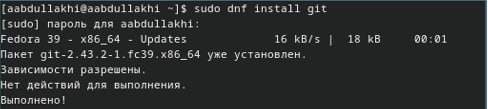

## Установка gh fedora
 
 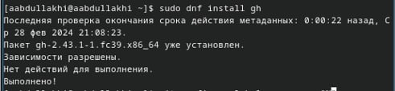
 
## Создайте ключи ssh по алгоритму rsa с ключём размером 4096 бит:

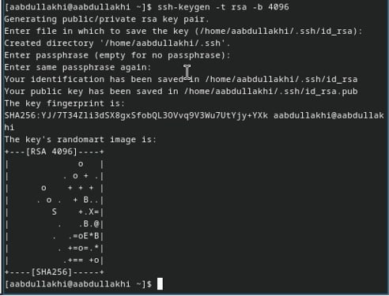

## по алгоритму ed25519:

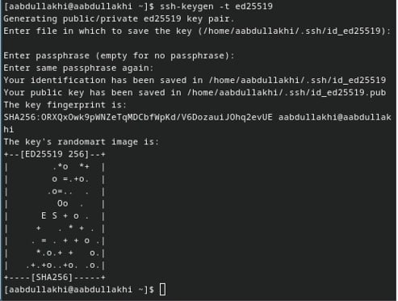

## Создайте ключи pgp - Генерируем ключ

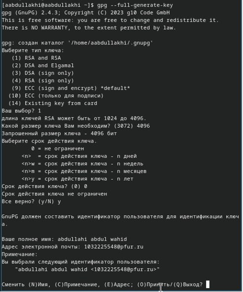

## Настройка github
 
 - у меня был гитхаб я создал в прошлом сместре
 
## Добавление PGP ключа в GitHub

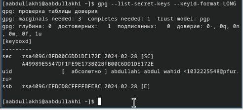

## Настройка автоматических подписей коммитов git

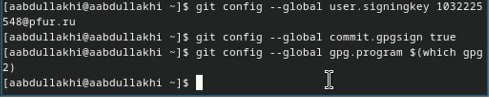

## Шаблон для рабочего пространства Сознание репозитория курса на основе шаблона
 - Необходимо создать шаблон рабочего пространства (см. Рабочее пространство для лабораторной работы).
 
 - Например, для 2022–2023 учебного года и предмета «Операционные системы» (код предмета os-intro) создание репозитория примет следующий вид:
 
 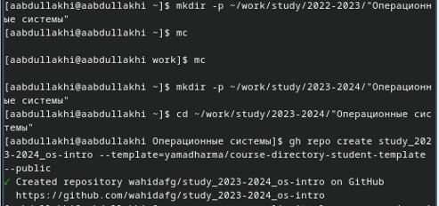
 
## Настройка каталога курса
 - Перейдите в каталог курса:
 
 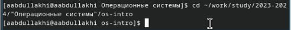
 
## Отправьте файлы на сервер:
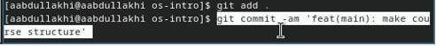
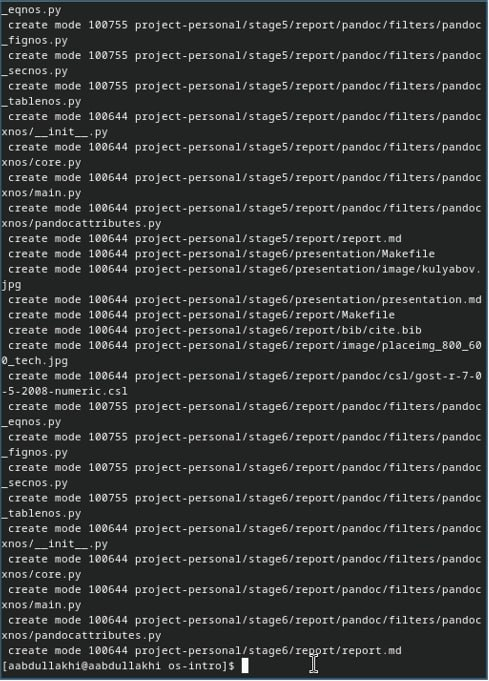
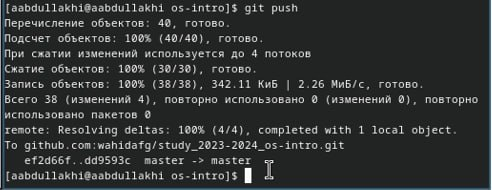

:::

