---
## Front matter
title: "Шаблон отчёта по лабораторной работе 2"
subtitle: "Простейший вариант"
author: "Абдуллахи Абдул Вахид"

## Generic otions
lang: ru-RU
toc-title: "Содержание"

## Bibliography
bibliography: bib/cite.bib
csl: pandoc/csl/gost-r-7-0-5-2008-numeric.csl

## Pdf output format
toc: true # Table of contents
toc-depth: 2
lof: true # List of figures
lot: true # List of tables
fontsize: 12pt
linestretch: 1.5
papersize: a4
documentclass: scrreprt
## I18n polyglossia
polyglossia-lang:
  name: russian
  options:
	- spelling=modern
	- babelshorthands=true
polyglossia-otherlangs:
  name: english
## I18n babel
babel-lang: russian
babel-otherlangs: english
## Fonts
mainfont: PT Serif
romanfont: PT Serif
sansfont: PT Sans
monofont: PT Mono
mainfontoptions: Ligatures=TeX
romanfontoptions: Ligatures=TeX
sansfontoptions: Ligatures=TeX,Scale=MatchLowercase
monofontoptions: Scale=MatchLowercase,Scale=0.9
## Biblatex
biblatex: true
biblio-style: "gost-numeric"
biblatexoptions:
  - parentracker=true
  - backend=biber
  - hyperref=auto
  - language=auto
  - autolang=other*
  - citestyle=gost-numeric
## Pandoc-crossref LaTeX customization
figureTitle: "Рис."
tableTitle: "Таблица"
listingTitle: "Листинг"
lofTitle: "Список иллюстраций"
lotTitle: "Список таблиц"
lolTitle: "Листинги"
## Misc options
indent: true
header-includes:
  - \usepackage{indentfirst}
  - \usepackage{float} # keep figures where there are in the text
  - \floatplacement{figure}{H} # keep figures where there are in the text
---

# Цель работы

Изучить идеологию и применение средств контроля версий.
Освоить умения по работе с git.
    
# Задание

Последовательность выполнения работы

Установка программного обеспечения

Установим git:

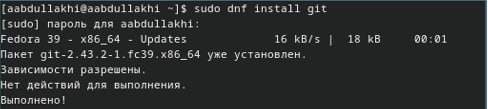{#fig:001 width=100%}

Установка gh
Fedora:

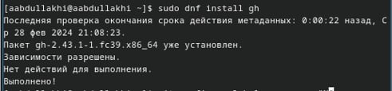{#fig:001 width=100%}

Базовая настройка git
Зададим имя и email владельца репозитория:

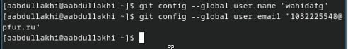{#fig:001 width=100%}

Настроим utf-8 в выводе сообщений git:

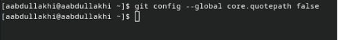{#fig:001 width=100%}

Зададим имя начальной ветки (будем называть её master):

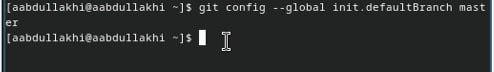{#fig:001 width=100%}

Параметр autocrlf:

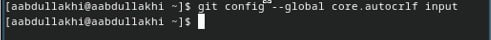{#fig:001 width=100%}

Параметр safecrlf:

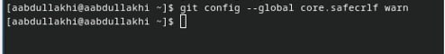{#fig:001 width=100%}

Создайте ключи ssh
по алгоритму rsa с ключём размером 4096 бит:

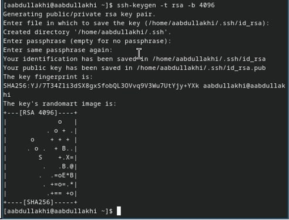{#fig:001 width=100%}

по алгоритму ed25519:

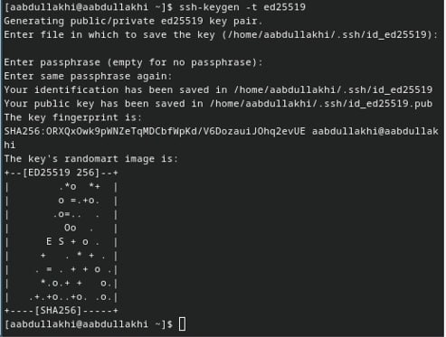{#fig:001 width=100%}

Создайте ключи pgp
Генерируем ключ

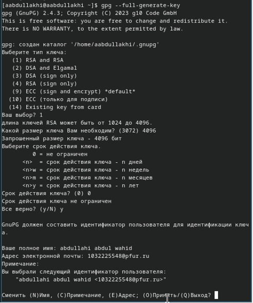{#fig:001 width=100%}

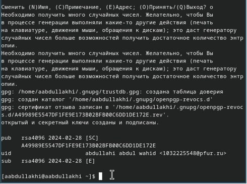{#fig:001 width=100%}

Настройка github
у меня был гитхаб я создал в прошлом сместре

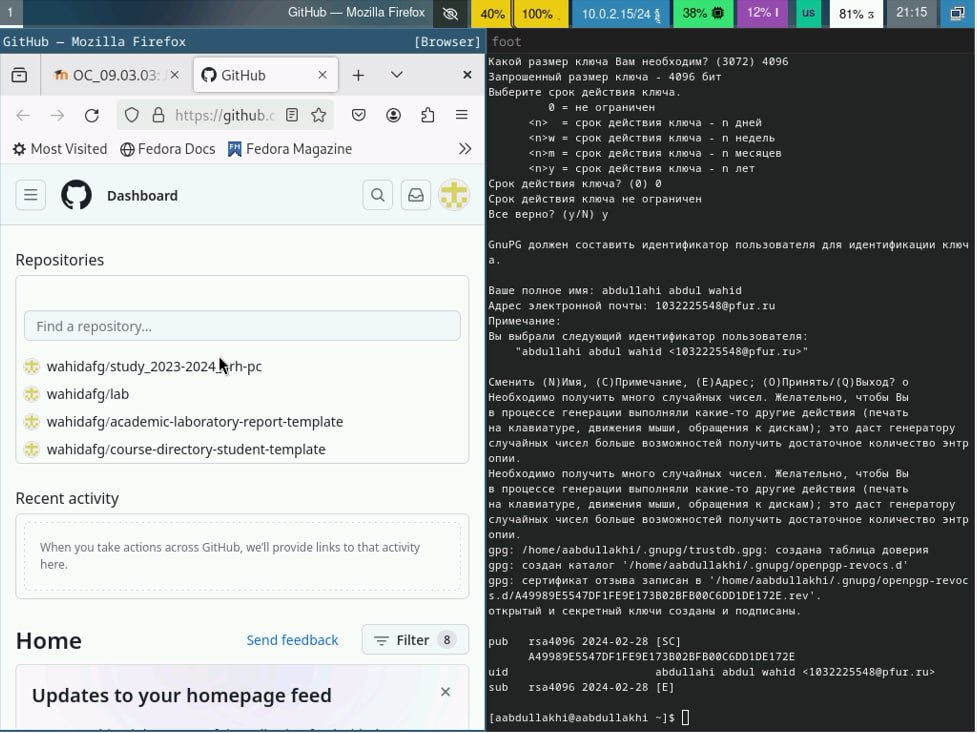{#fig:001 width=100%}

Добавление PGP ключа в GitHub
Выводим список ключей и копируем отпечаток приватного ключа:

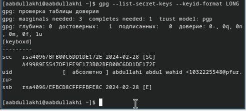{#fig:001 width=100%}

Cкопируйте ваш сгенерированный PGP ключ в буфер обмена:

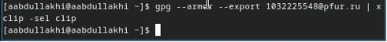{#fig:001 width=100%}

Перейдите в настройки GitHub (https://github.com/settings/keys), нажмите на кнопку New GPG key и вставьте полученный ключ в поле ввода.

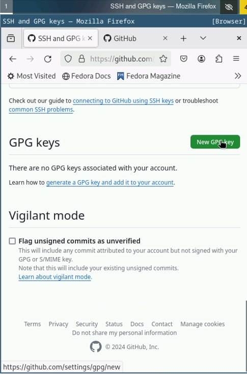{#fig:001 width=100%}

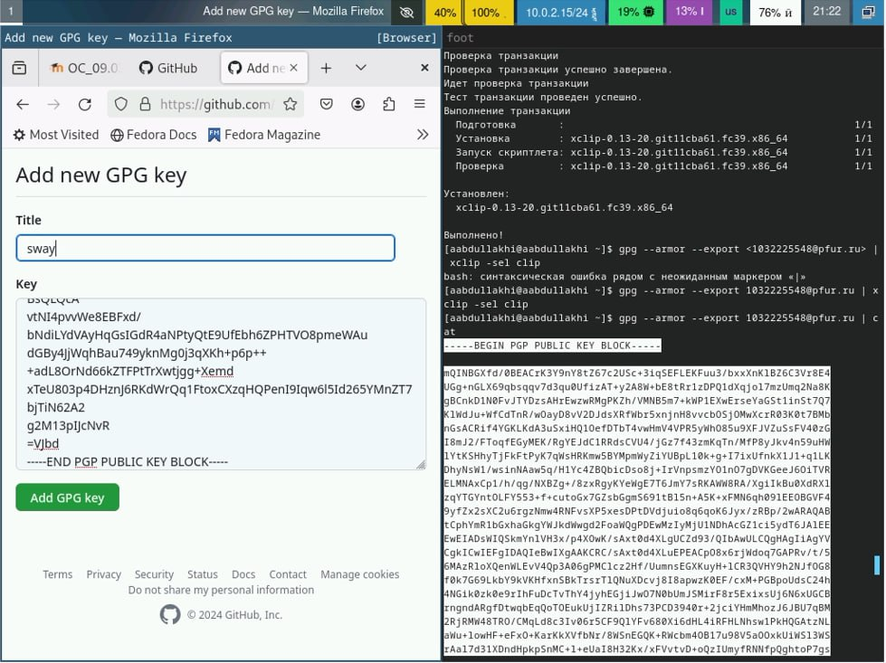{#fig:001 width=100%}

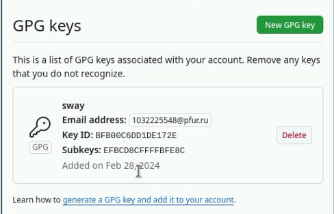{#fig:001 width=100%}

Настройка автоматических подписей коммитов git
Используя введёный email, укажите Git применять его при подписи коммитов:

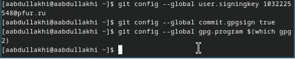{#fig:001 width=100%}

Настройка gh
Для начала необходимо авторизоваться

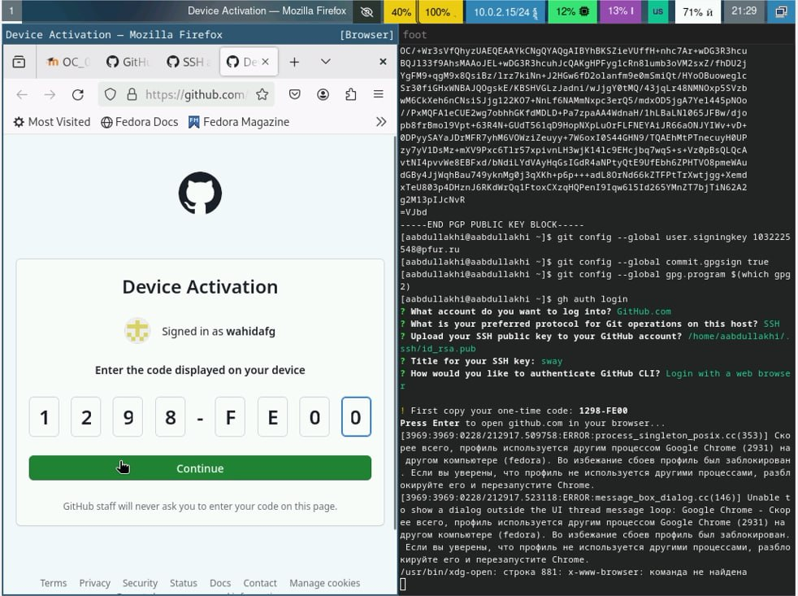{#fig:001 width=100%}

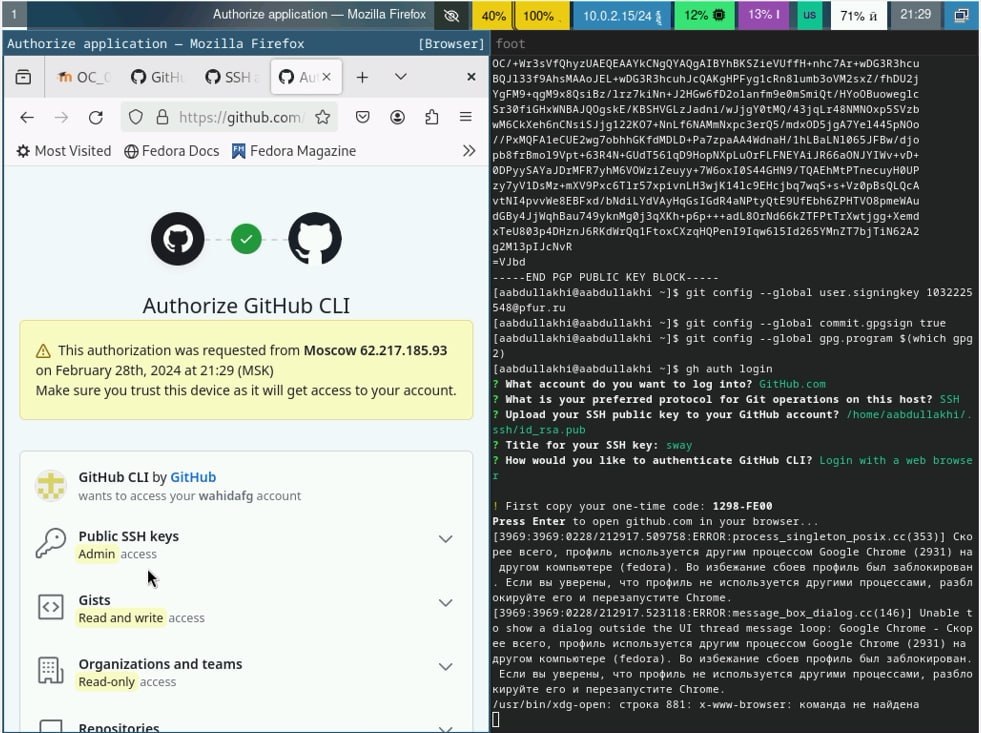{#fig:001 width=100%}

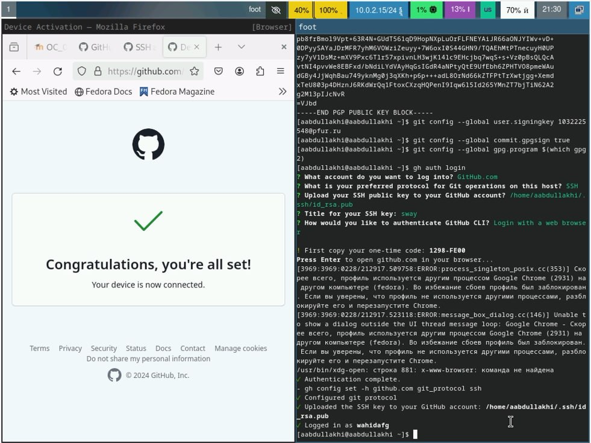{#fig:001 width=100%}

Шаблон для рабочего пространства

Сознание репозитория курса на основе шаблона

Необходимо создать шаблон рабочего пространства (см. Рабочее пространство для лабораторной работы).

Например, для 2022–2023 учебного года и предмета «Операционные системы» (код предмета os-intro) создание репозитория примет следующий вид:

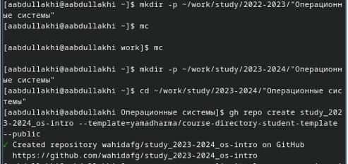{#fig:001 width=100%}

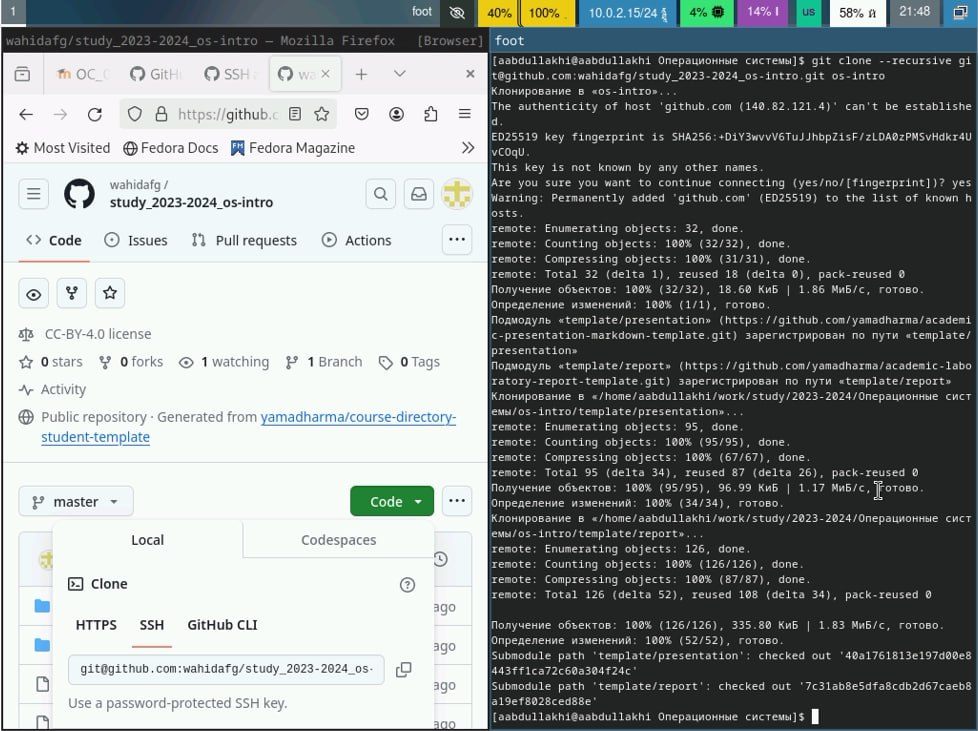{#fig:001 width=100%}

Настройка каталога курса
Перейдите в каталог курса:

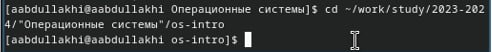{#fig:001 width=100%}

Удалите лишние файлы:

{#fig:001 width=100%}

Создайте необходимые каталоги:

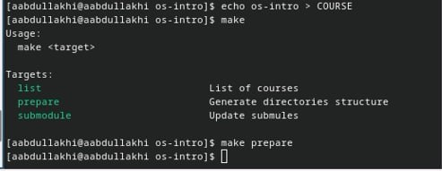{#fig:001 width=100%}

Отправьте файлы на сервер:

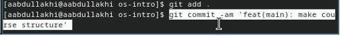{#fig:001 width=100%}

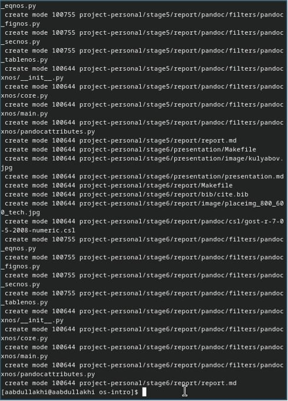{#fig:001 width=100%}

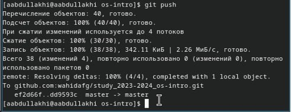{#fig:001 width=100%}

# Теоретическое введение

Здесь описываются теоретические аспекты, связанные с выполнением работы.

Например, в табл. [-@tbl:std-dir] приведено краткое описание стандартных каталогов Unix.

: Описание некоторых каталогов файловой системы GNU Linux {#tbl:std-dir}

| Имя каталога | Описание каталога                                                                                                          |
|--------------|----------------------------------------------------------------------------------------------------------------------------|
| `/`          | Корневая директория, содержащая всю файловую                                                                               |
| `/bin `      | Основные системные утилиты, необходимые как в однопользовательском режиме, так и при обычной работе всем пользователям     |
| `/etc`       | Общесистемные конфигурационные файлы и файлы конфигурации установленных программ                                           |
| `/home`      | Содержит домашние директории пользователей, которые, в свою очередь, содержат персональные настройки и данные пользователя |
| `/media`     | Точки монтирования для сменных носителей                                                                                   |
| `/root`      | Домашняя директория пользователя  `root`                                                                                   |
| `/tmp`       | Временные файлы                                                                                                            |
| `/usr`       | Вторичная иерархия для данных пользователя                                                                                 |

Более подробно про Unix см. в [@tanenbaum_book_modern-os_ru; @robbins_book_bash_en; @zarrelli_book_mastering-bash_en; @newham_book_learning-bash_en].

# Выполнение лабораторной работы

Описываются проведённые действия, в качестве иллюстрации даётся ссылка на иллюстрацию (рис. [-@fig:001]).

{#fig:001 width=70%}

# Выводы

Здесь кратко описываются итоги проделанной работы.

# Список литературы{.unnumbered}

::: {#refs}
:::
