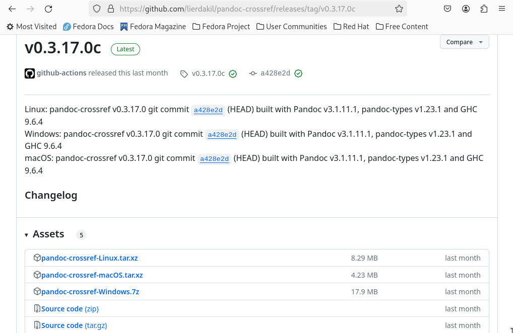
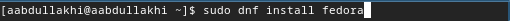
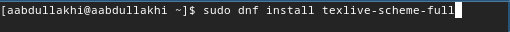
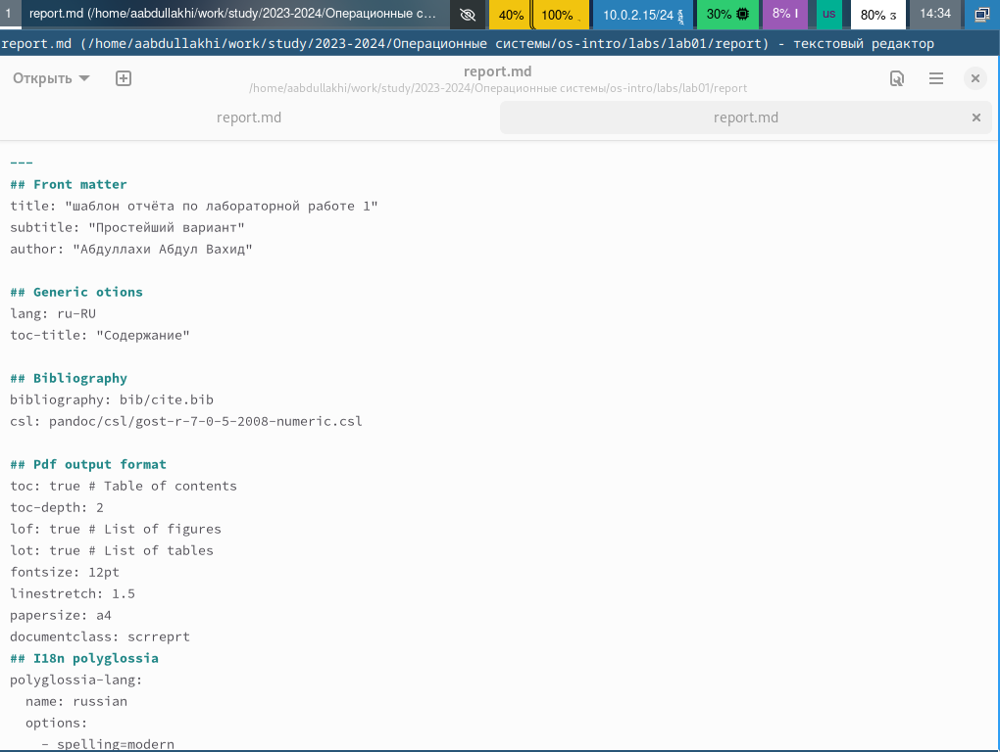
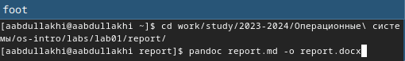
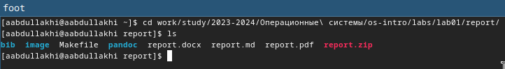
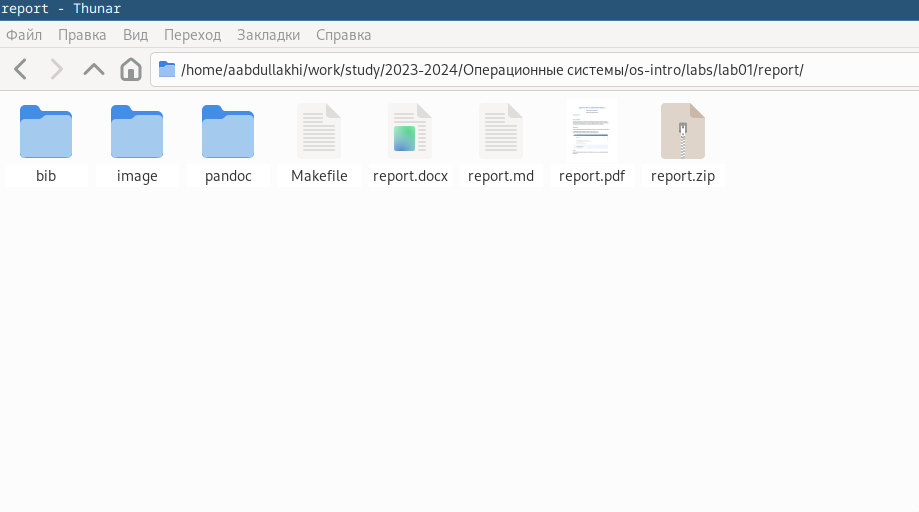

---
## Front matter
lang: ru-RU
title: Лабораторная работа 3
author:
  - Абдуллахи Абдул Вахид
institute:
  - Российский университет дружбы народов, Москва, Россия
date: 02 марта 2024
группа: НПИбд -03-23

## i18n babel
babel-lang: russian
babel-otherlangs: english

## Fonts
mainfont: PT Serif
romanfont: PT Serif
sansfont: PT Sans
monofont: PT Mono
mainfontoptions: Ligatures=TeX
romanfontoptions: Ligatures=TeX
sansfontoptions: Ligatures=TeX,Scale=MatchLowercase
monofontoptions: Scale=MatchLowercase,Scale=0.9

## Formatting pdf
toc: false
toc-title: Содержание
slide_level: 2
aspectratio: 169
section-titles: true
theme: metropolis
header-includes:
 - \metroset{progressbar=frametitle,sectionpage=progressbar,numbering=fraction}
 - '\makeatletter'
 - '\beamer@ignorenonframefalse'
 - '\makeatother'
---

#   Ход работы

## скачивание Pandoc

## установка Pandoc
можно установить через команду:

 - 1 - sudo dnf install pandoc
 
 - 2 - sudo dnf install texlive-scheme-full
## Установка Pandoc

## Изменение шаблона Markdown

## переход в каталог report в терминале

## конвертируем в pdf и docx
1 - pandoc report.md -o report.docx

2 - pandoc report.md -o report.pdf

## проверка создания файлов

# Спасибо за внимание

