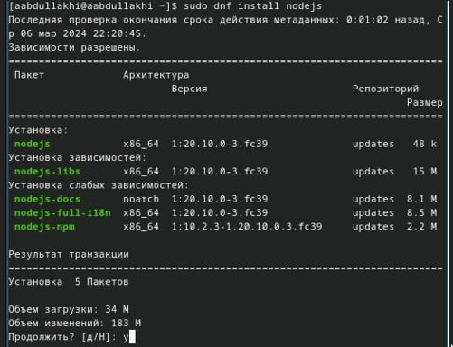
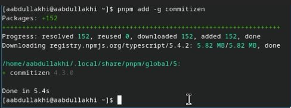
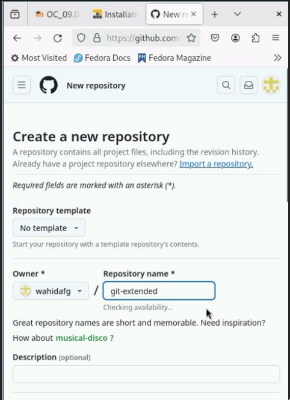
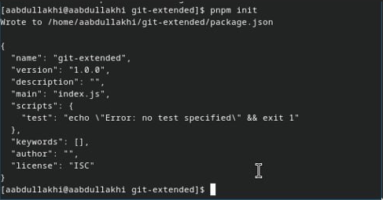
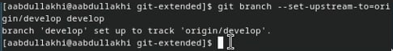
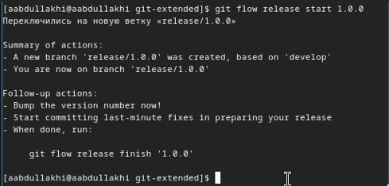
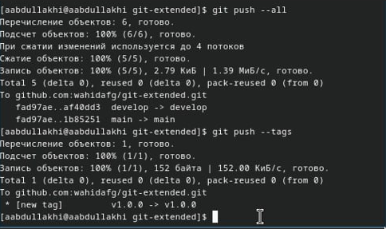
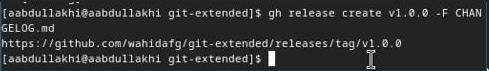
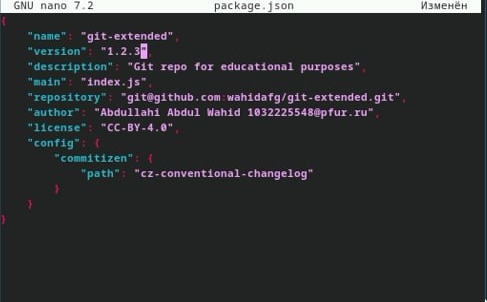
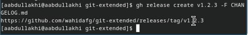

---
## Front matter
lang: ru-RU
title: Лаборатороная работа 4
author:
  - Абдуллахи Абдул Вахид
institute:
  - Российский университет дружбы народов, Москва, Россия
  - Группа - НПИбд - 03 - 23
date: 09 март 2024

## i18n babel
babel-lang: russian
babel-otherlangs: english

## Fonts
mainfont: PT Serif
romanfont: PT Serif
sansfont: PT Sans
monofont: PT Mono
mainfontoptions: Ligatures=TeX
romanfontoptions: Ligatures=TeX
sansfontoptions: Ligatures=TeX,Scale=MatchLowercase
monofontoptions: Scale=MatchLowercase,Scale=0.9

## Formatting pdf
toc: false
toc-title: Содержание
slide_level: 2
aspectratio: 169
section-titles: true
theme: metropolis
header-includes:
 - \metroset{progressbar=frametitle,sectionpage=progressbar,numbering=fraction}
 - '\makeatletter'
 - '\beamer@ignorenonframefalse'
 - '\makeatother'
---

## Цель работы

Получение навыков правильной работы с репозиториями git.

## Установка программного обеспечения

1 - dnf copr enable elegos/gitflow

2 - dnf install gitflow

## Установка Node.js

## установка git-cz

## Создание репозитория git

## Конфигурация для пакетов Node.js

## Установите внешнюю ветку как вышестоящую для этой ветки

## Создадим релиз с версией 1.0.0

## Отправим данные на github

## Создадим релиз на github

## Обновите номер версии в файле package.json. Установите её в 1.2.3.

## Создадим релиз на github с комментарием из журнала изменений

# Спасибо за внимание

:::
