---
## Front matter
title: "Шаблон отчёта по лабораторной работе 4"
subtitle: "Простейший вариант"
author: "Абдуллахи Абдул Вахид"

## Generic otions
lang: ru-RU
toc-title: "Содержание"

## Bibliography
bibliography: bib/cite.bib
csl: pandoc/csl/gost-r-7-0-5-2008-numeric.csl

## Pdf output format
toc: true # Table of contents
toc-depth: 2
lof: true # List of figures
lot: true # List of tables
fontsize: 12pt
linestretch: 1.5
papersize: a4
documentclass: scrreprt
## I18n polyglossia
polyglossia-lang:
  name: russian
  options:
	- spelling=modern
	- babelshorthands=true
polyglossia-otherlangs:
  name: english
## I18n babel
babel-lang: russian
babel-otherlangs: english
## Fonts
mainfont: PT Serif
romanfont: PT Serif
sansfont: PT Sans
monofont: PT Mono
mainfontoptions: Ligatures=TeX
romanfontoptions: Ligatures=TeX
sansfontoptions: Ligatures=TeX,Scale=MatchLowercase
monofontoptions: Scale=MatchLowercase,Scale=0.9
## Biblatex
biblatex: true
biblio-style: "gost-numeric"
biblatexoptions:
  - parentracker=true
  - backend=biber
  - hyperref=auto
  - language=auto
  - autolang=other*
  - citestyle=gost-numeric
## Pandoc-crossref LaTeX customization
figureTitle: "Рис."
tableTitle: "Таблица"
listingTitle: "Листинг"
lofTitle: "Список иллюстраций"
lotTitle: "Список таблиц"
lolTitle: "Листинги"
## Misc options
indent: true
header-includes:
  - \usepackage{indentfirst}
  - \usepackage{float} # keep figures where there are in the text
  - \floatplacement{figure}{H} # keep figures where there are in the text
---

# Цель работы

Получение навыков правильной работы с репозиториями git.

# Задание

Выполнить работу для тестового репозитория.

Преобразовать рабочий репозиторий в репозиторий с git-flow и conventional commits.

Последовательность выполнения работы

Установка программного обеспечения

Установка git-flow

установка gitflow

Enable the copr repository

dnf copr enable elegos/gitflow

Install gitflow

dnf install gitflow

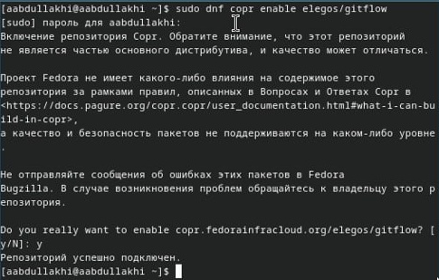{#fig:001 width=100%}

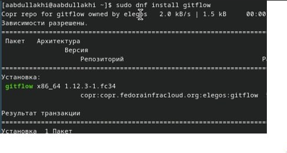{#fig:001 width=100%}

Установка Node.js

На Node.js базируется программное обеспечение для

семантического версионирования и общепринятых коммитов.

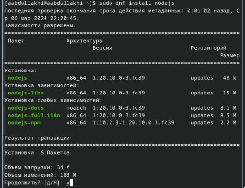{#fig:001 width=100%}

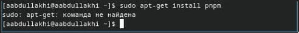{#fig:001 width=100%}

у меня не получилось установить pnpm поэтому я установил его через его сайт 

{#fig:001 width=100%}

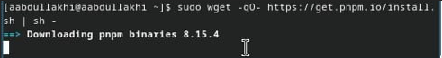{#fig:001 width=100%}

Настройка Node.js

запустим 

ерелогиньтесь, или выполните

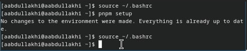{#fig:001 width=100%}

Общепринятые коммиты

установка git-cz

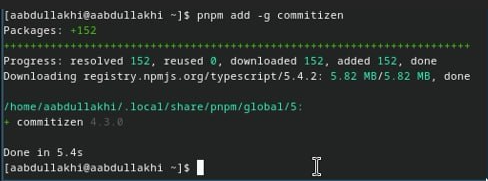{#fig:001 width=100%}

standard-changelog

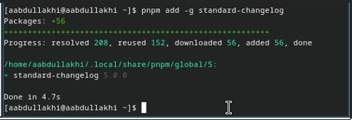{#fig:001 width=100%}

Создание репозитория git

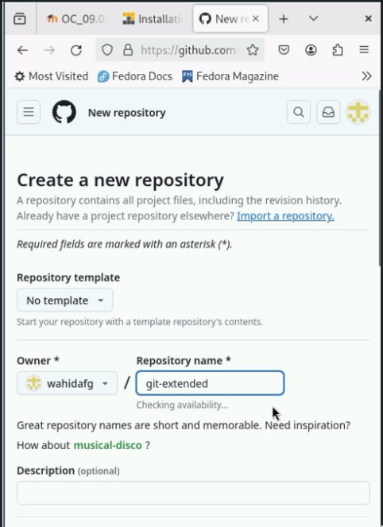{#fig:001 width=100%}

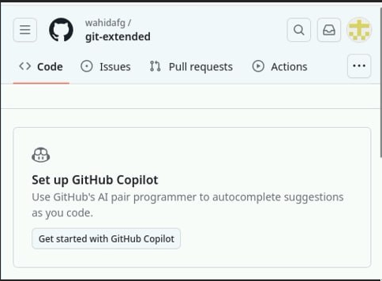{#fig:001 width=100%}

Делаем первый коммит и выкладываем на github:

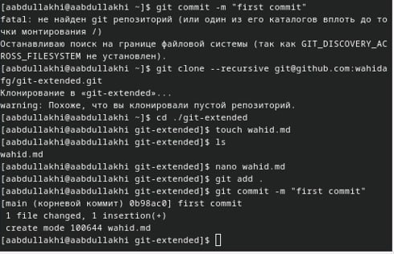{#fig:001 width=100%}

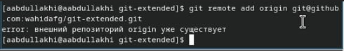{#fig:001 width=100%}

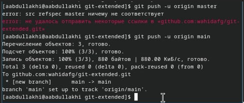{#fig:001 width=100%}

Конфигурация для пакетов Node.js

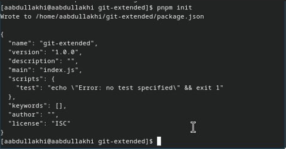{#fig:001 width=100%}

Необходимо заполнить несколько параметров пакета.

Название пакета.
Лицензия пакета. Список лицензий для npm: https://spdx.org/licenses/. Предлагается выбирать лицензию CC-BY-4.0.

Сконфигурим формат коммитов. Для этого добавим в файл package.json команду для формирования коммитов:

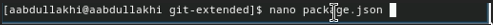{#fig:001 width=100%}

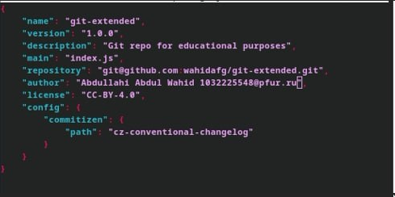{#fig:001 width=100%}

Добавим новые файлы:

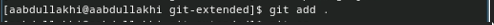{#fig:001 width=100%}

Выполним коммит:

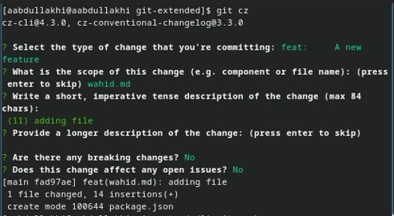{#fig:001 width=100%}

отправил на гитхаб

Инициализируем git-flow

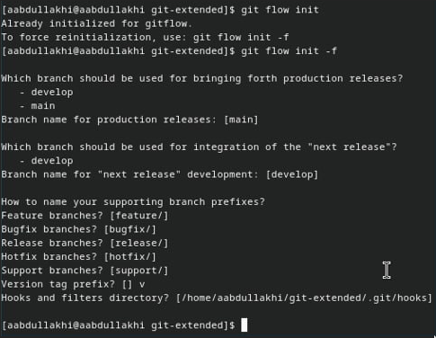{#fig:001 width=100%}

Проверьте, что Вы на ветке develop:

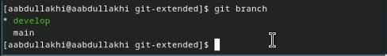{#fig:001 width=100%}

Загрузите весь репозиторий в хранилище:

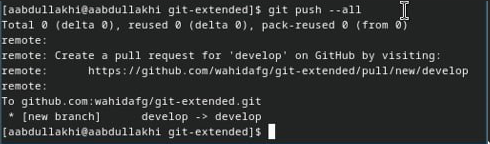{#fig:001 width=100%}

Установите внешнюю ветку как вышестоящую для этой ветки:

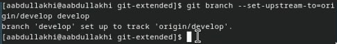{#fig:001 width=100%}

Создадим релиз с версией 1.0.0

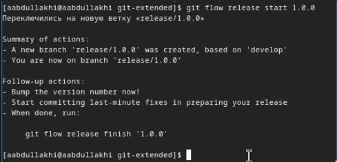{#fig:001 width=100%}

Создадим журнал изменений

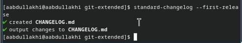{#fig:001 width=100%}

Добавим журнал изменений в индекс

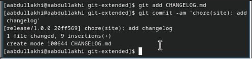{#fig:001 width=100%}

Зальём релизную ветку в основную ветку

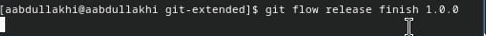{#fig:001 width=100%}

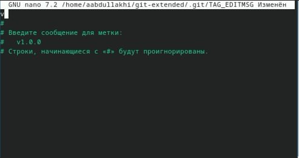{#fig:001 width=100%}

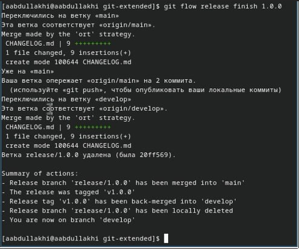{#fig:001 width=100%}

Отправим данные на github

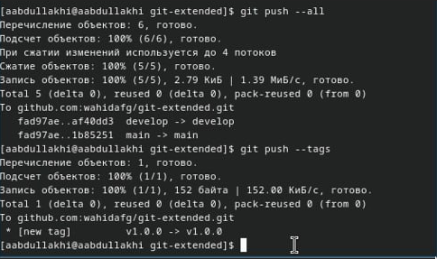{#fig:001 width=100%}

Создадим релиз на github. Для этого будем использовать утилиты работы с github:

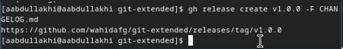{#fig:001 width=100%}

Разработка новой функциональности

Создадим ветку для новой функциональности:

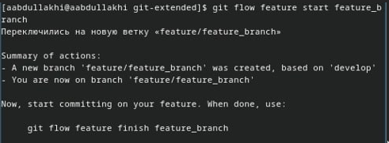{#fig:001 width=100%}

Далее, продолжаем работу c git как обычно.

По окончании разработки новой функциональности следующим 

шагом следует объединить ветку feature_branch c develop:

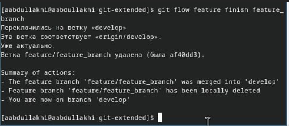{#fig:001 width=100%}

Создание релиза git-flow

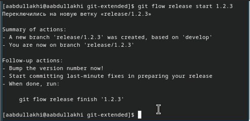{#fig:001 width=100%}

Обновите номер версии в файле package.json. Установите её в 1.2.3.

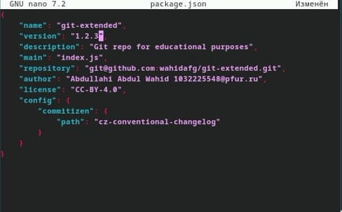{#fig:001 width=100%}

Создадим журнал изменений

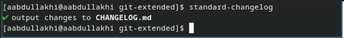{#fig:001 width=100%}

Добавим журнал изменений в индекс

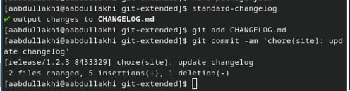{#fig:001 width=100%}

Зальём релизную ветку в основную ветку

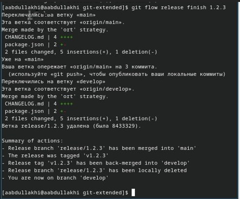{#fig:001 width=100%}

Отправим данные на github

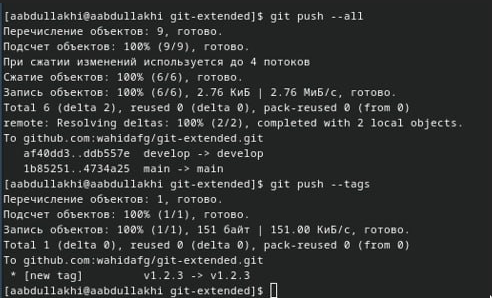{#fig:001 width=100%}

Создадим релиз на github с комментарием из журнала изменений:

{#fig:001 width=100%}

# Теоретическое введение

Здесь описываются теоретические аспекты, связанные с выполнением работы.

Например, в табл. [-@tbl:std-dir] приведено краткое описание стандартных каталогов Unix.

: Описание некоторых каталогов файловой системы GNU Linux {#tbl:std-dir}

| Имя каталога | Описание каталога                                                                                                          |
|--------------|----------------------------------------------------------------------------------------------------------------------------|
| `/`          | Корневая директория, содержащая всю файловую                                                                               |
| `/bin `      | Основные системные утилиты, необходимые как в однопользовательском режиме, так и при обычной работе всем пользователям     |
| `/etc`       | Общесистемные конфигурационные файлы и файлы конфигурации установленных программ                                           |
| `/home`      | Содержит домашние директории пользователей, которые, в свою очередь, содержат персональные настройки и данные пользователя |
| `/media`     | Точки монтирования для сменных носителей                                                                                   |
| `/root`      | Домашняя директория пользователя  `root`                                                                                   |
| `/tmp`       | Временные файлы                                                                                                            |
| `/usr`       | Вторичная иерархия для данных пользователя                                                                                 |

Более подробно про Unix см. в [@tanenbaum_book_modern-os_ru; @robbins_book_bash_en; @zarrelli_book_mastering-bash_en; @newham_book_learning-bash_en].

# Выполнение лабораторной работы

Описываются проведённые действия, в качестве иллюстрации даётся ссылка на иллюстрацию (рис. [-@fig:001]).

{#fig:001 width=70%}

# Выводы

Здесь кратко описываются итоги проделанной работы.

# Список литературы{.unnumbered}

::: {#refs}
:::
