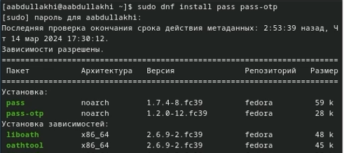
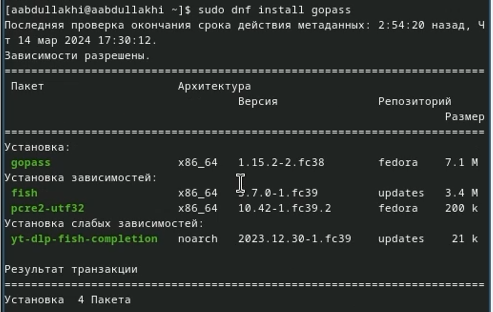
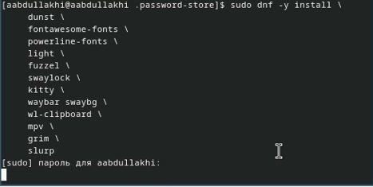
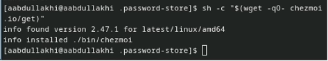
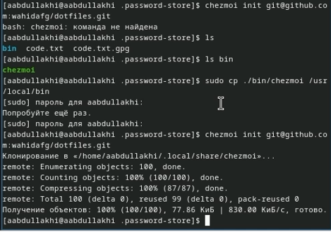
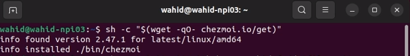
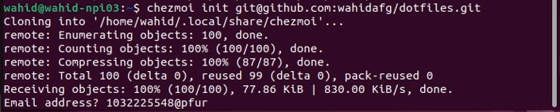
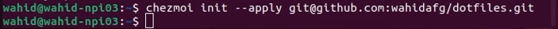

---
## Front matter
lang: ru-RU
title: лабораторная работа 5
author:
  - Абдуллахи Абдул Вахид
institute:
  - Российский университет дружбы народов, Москва, Россия
date: 16 Марта 2024

## i18n babel
babel-lang: russian
babel-otherlangs: english

## Fonts
mainfont: PT Serif
romanfont: PT Serif
sansfont: PT Sans
monofont: PT Mono
mainfontoptions: Ligatures=TeX
romanfontoptions: Ligatures=TeX
sansfontoptions: Ligatures=TeX,Scale=MatchLowercase
monofontoptions: Scale=MatchLowercase,Scale=0.9

## Formatting pdf
toc: false
toc-title: Содержание
slide_level: 2
aspectratio: 169
section-titles: true
theme: metropolis
header-includes:
 - \metroset{progressbar=frametitle,sectionpage=progressbar,numbering=fraction}
 - '\makeatletter'
 - '\beamer@ignorenonframefalse'
 - '\makeatother'
---

## Цель работы

# Настройка рабочей среды

## Установка
- pass 

## Установка
- gopass

## Установите дополнительное программное обеспечение

## Установка бинарного файла
- с помощью wget

## Подключение репозитория к своей системе

- Инициализируйте chezmoi с вашим репозиторием dotfiles:

## Использование chezmoi на нескольких машинах

## На второй машине инициализируйте chezmoi с вашим репозиторием dotfiles

## Настройка новой машины с помощью одной команды

- Можно установить свои dotfiles на новый компьютер с помощью одной команды

# спасибо за внимание 

