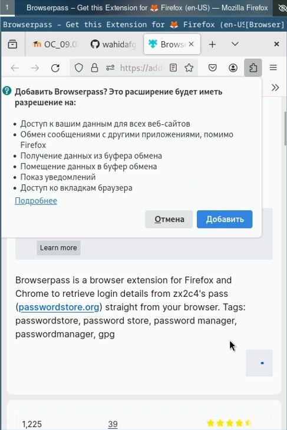

---
## Front matter
title: "Шаблон отчёта по лабораторной работе 5"
subtitle: "Простейший вариант"
author: "Абдуллахи Абдул Вахид"

## Generic otions
lang: ru-RU
toc-title: "Содержание"

## Bibliography
bibliography: bib/cite.bib
csl: pandoc/csl/gost-r-7-0-5-2008-numeric.csl

## Pdf output format
toc: true # Table of contents
toc-depth: 2
lof: true # List of figures
lot: true # List of tables
fontsize: 12pt
linestretch: 1.5
papersize: a4
documentclass: scrreprt
## I18n polyglossia
polyglossia-lang:
  name: russian
  options:
	- spelling=modern
	- babelshorthands=true
polyglossia-otherlangs:
  name: english
## I18n babel
babel-lang: russian
babel-otherlangs: english
## Fonts
mainfont: PT Serif
romanfont: PT Serif
sansfont: PT Sans
monofont: PT Mono
mainfontoptions: Ligatures=TeX
romanfontoptions: Ligatures=TeX
sansfontoptions: Ligatures=TeX,Scale=MatchLowercase
monofontoptions: Scale=MatchLowercase,Scale=0.9
## Biblatex
biblatex: true
biblio-style: "gost-numeric"
biblatexoptions:
  - parentracker=true
  - backend=biber
  - hyperref=auto
  - language=auto
  - autolang=other*
  - citestyle=gost-numeric
## Pandoc-crossref LaTeX customization
figureTitle: "Рис."
tableTitle: "Таблица"
listingTitle: "Листинг"
lofTitle: "Список иллюстраций"
lotTitle: "Список таблиц"
lolTitle: "Листинги"
## Misc options
indent: true
header-includes:
  - \usepackage{indentfirst}
  - \usepackage{float} # keep figures where there are in the text
  - \floatplacement{figure}{H} # keep figures where there are in the text
---

# Цель работы

Настройка рабочей среды.

- Менеджер паролей pass — программа, сделанная в рамках идеологии Unix.

- Также носит название стандартного менеджера паролей для Unix (The standard Unix password manager).

# Задание

Менеджер паролей pass

Установка

- pass

{#fig:001 width=100%}

- gopass

{#fig:001 width=100%}

Настройка

1. Ключи GPG

- Просмотр списка ключей:

{#fig:001 width=100%}

2. Инициализация хранилища

- Инициализируем хранилище:

{#fig:001 width=100%}

3. Синхронизация с git

- Создадим структуру git:

{#fig:001 width=100%}

- Также можно задать адрес репозитория на хостинге (репозиторий необходимо предварительно создать):

{#fig:001 width=100%}

{#fig:001 width=100%}

- Для синхронизации выполняется следующая команда:

{#fig:001 width=100%}

1. Прямые изменения

- Следует заметить, что отслеживаются только изменения, сделанные через сам gopass (или pass).

- Если изменения сделаны непосредственно на файловой системе, необходимо вручную закоммитить и выложить изменения:

{#fig:001 width=100%}

- Проверить статус синхронизации модно командой

{#fig:001 width=100%}

Настройка интерфейса с броузером

- Для взаимодействия с броузером используется интерфейс native messaging.

- Поэтому кроме плагина к броузеру устанавливается программа, обеспечивающая интерфейс native messaging.

- Плагин для Firefox: https://addons.mozilla.org/en-US/firefox/addon/browserpass-ce/.

- Fedora

{#fig:001 width=100%}

{#fig:001 width=100%}

{#fig:001 width=100%}

Сохранение пароля

1. Добавить новый пароль

- Выполните:

{#fig:001 width=100%}

- Отобразите пароль для указанного имени файла:

{#fig:001 width=100%}

- Замените существующий пароль:

{#fig:001 width=100%}

Управление файлами конфигурации

Дополнительное программное обеспечение

- Установите дополнительное программное обеспечение:

{#fig:001 width=100%}

- Установите шрифты:

{#fig:001 width=100%}

{#fig:001 width=100%}

{#fig:001 width=100%}

{#fig:001 width=100%}

Установка

- Установка бинарного файла. Скрипт определяет архитектуру процессора и операционную систему и скачивает необходимый файл:

- с помощью wget:

{#fig:001 width=100%}

Создание собственного репозитория с помощью утилит

- Создадим свой репозиторий для конфигурационных файлов на основе шаблона:

{#fig:001 width=100%}

Подключение репозитория к своей системе

-  Инициализируйте chezmoi с вашим репозиторием dotfiles:

{#fig:001 width=100%}

- Проверьте, какие изменения внесёт chezmoi в домашний каталог, запустив:

{#fig:001 width=100%}

{#fig:001 width=100%}

- Если вас устраивают изменения, внесённые chezmoi, запустите:

{#fig:001 width=100%}

{#fig:001 width=100%}

Использование chezmoi на нескольких машинах

{#fig:001 width=100%}

- На второй машине инициализируйте chezmoi с вашим репозиторием dotfiles:

{#fig:001 width=100%}

- Проверьте, какие изменения внесёт chezmoi в домашний каталог, запустив:

{#fig:001 width=100%}

{#fig:001 width=100%}

- Если вас устраивают изменения, внесённые chezmoi, запустите:

{#fig:001 width=100%}

{#fig:001 width=100%}

- При существующем каталоге chezmoi можно получить и применить последние изменения из вашего репозитория:

{#fig:001 width=100%}

Настройка новой машины с помощью одной команды

- Можно установить свои dotfiles на новый компьютер с помощью одной команды:

{#fig:001 width=100%}

Ежедневные операции c chezmoi

1. Извлеките последние изменения из репозитория и примените их

- Можно извлечь изменения из репозитория и применить их одной командой:

{#fig:001 width=100%}

2. Извлеките последние изменения из своего репозитория и посмотрите, что изменится, фактически не применяя изменения

- Выполните:

{#fig:001 width=100%}

- Если вы довольны изменениями, вы можете применить их:

{#fig:001 width=100%}

3. Автоматически фиксируйте и отправляйте изменения в репозиторий

- Можно автоматически фиксировать и отправлять изменения в исходный каталог в репозиторий.

- Эта функция отключена по умолчанию.

- Чтобы включить её, добавьте в файл конфигурации ~/.config/chezmoi/chezmoi.toml следующее:

{#fig:001 width=100%}

{#fig:001 width=100%}

# Теоретическое введение

Здесь описываются теоретические аспекты, связанные с выполнением работы.

Например, в табл. [-@tbl:std-dir] приведено краткое описание стандартных каталогов Unix.

: Описание некоторых каталогов файловой системы GNU Linux {#tbl:std-dir}

| Имя каталога | Описание каталога                                                                                                          |
|--------------|----------------------------------------------------------------------------------------------------------------------------|
| `/`          | Корневая директория, содержащая всю файловую                                                                               |
| `/bin `      | Основные системные утилиты, необходимые как в однопользовательском режиме, так и при обычной работе всем пользователям     |
| `/etc`       | Общесистемные конфигурационные файлы и файлы конфигурации установленных программ                                           |
| `/home`      | Содержит домашние директории пользователей, которые, в свою очередь, содержат персональные настройки и данные пользователя |
| `/media`     | Точки монтирования для сменных носителей                                                                                   |
| `/root`      | Домашняя директория пользователя  `root`                                                                                   |
| `/tmp`       | Временные файлы                                                                                                            |
| `/usr`       | Вторичная иерархия для данных пользователя                                                                                 |

Более подробно про Unix см. в [@tanenbaum_book_modern-os_ru; @robbins_book_bash_en; @zarrelli_book_mastering-bash_en; @newham_book_learning-bash_en].

# Выполнение лабораторной работы

Описываются проведённые действия, в качестве иллюстрации даётся ссылка на иллюстрацию (рис. [-@fig:001]).

# Выводы

Здесь кратко описываются итоги проделанной работы.

# Список литературы{.unnumbered}

::: {#refs}
:::
