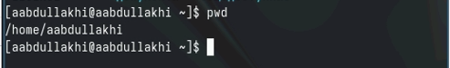

---
## Front matter
lang: ru-RU
title: Лабораторная работа 6
author:
  - Абдуллахи Абдул Вахид
institute:
  - Российский университет дружбы народов, Москва, Россия
date: 16 января 2024

## i18n babel
babel-lang: russian
babel-otherlangs: english
## Fonts
mainfont: PT Serif
romanfont: PT Serif
sansfont: PT Sans
monofont: PT Mono
mainfontoptions: Ligatures=TeX
romanfontoptions: Ligatures=TeX
sansfontoptions: Ligatures=TeX,Scale=MatchLowercase
monofontoptions: Scale=MatchLowercase,Scale=0.9
## Formatting pdf
toc: false
toc-title: Содержание
slide_level: 2
aspectratio: 169
section-titles: true
theme: metropolis
header-includes:
 - \metroset{progressbar=frametitle,sectionpage=progressbar,numbering=fraction}
 - '\makeatletter'
 - '\beamer@ignorenonframefalse'
 - '\makeatother'
---

## Цель работы

- Приобретение практических навыков взаимодействия пользователя с системой по средством командной строки.

## Определите полное имя вашего домашнего каталога

- Можно посмотрить через команду pwd

## Перейдите в Ваш домашний каталог и выведите на экран его содержимое

## создание нового файла

## удаление 

## опции команды ls

## опции команды ls

## опции команды ls

## отсортировать по времени последнего изменения

## Используйте команду man для просмотра описания следующих команд: cd, pwd, mkdir,rmdir, rm

## команда history

# спасибо за внимание

