---
## Front matter
title: "Шаблон отчёта по лабораторной работе 10"
subtitle: "Простейший вариант"
author: "Абдуллахи Абдул Вахид"

## Generic otions
lang: ru-RU
toc-title: "Содержание"

## Bibliography
bibliography: bib/cite.bib
csl: pandoc/csl/gost-r-7-0-5-2008-numeric.csl

## Pdf output format
toc: true # Table of contents
toc-depth: 2
lof: true # List of figures
lot: true # List of tables
fontsize: 12pt
linestretch: 1.5
papersize: a4
documentclass: scrreprt
## I18n polyglossia
polyglossia-lang:
  name: russian
  options:
	- spelling=modern
	- babelshorthands=true
polyglossia-otherlangs:
  name: english
## I18n babel
babel-lang: russian
babel-otherlangs: english
## Fonts
mainfont: PT Serif
romanfont: PT Serif
sansfont: PT Sans
monofont: PT Mono
mainfontoptions: Ligatures=TeX
romanfontoptions: Ligatures=TeX
sansfontoptions: Ligatures=TeX,Scale=MatchLowercase
monofontoptions: Scale=MatchLowercase,Scale=0.9
## Biblatex
biblatex: true
biblio-style: "gost-numeric"
biblatexoptions:
  - parentracker=true
  - backend=biber
  - hyperref=auto
  - language=auto
  - autolang=other*
  - citestyle=gost-numeric
## Pandoc-crossref LaTeX customization
figureTitle: "Рис."
tableTitle: "Таблица"
listingTitle: "Листинг"
lofTitle: "Список иллюстраций"
lotTitle: "Список таблиц"
lolTitle: "Листинги"
## Misc options
indent: true
header-includes:
  - \usepackage{indentfirst}
  - \usepackage{float} # keep figures where there are in the text
  - \floatplacement{figure}{H} # keep figures where there are in the text
---

# Цель работы

Познакомиться с операционной системой Linux. Получить практические навыки работы с редактором vi, установленным по умолчанию практически во всех дистрибутивах.

# Задание

1. Ознакомиться с теоретическим материалом.

2. Ознакомиться с редактором vi.

3. Вызовите vi и создайте файл hello.sh

1. Создайте каталог с именем ~/work/os/lab06

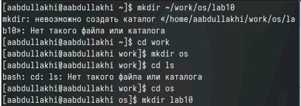{#fig:001 width=70%}

2. Перейдите во вновь созданный каталог.

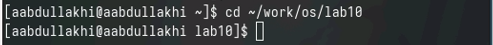{#fig:001 width=70%}

3. Вызовите vi и создайте файл hello.sh

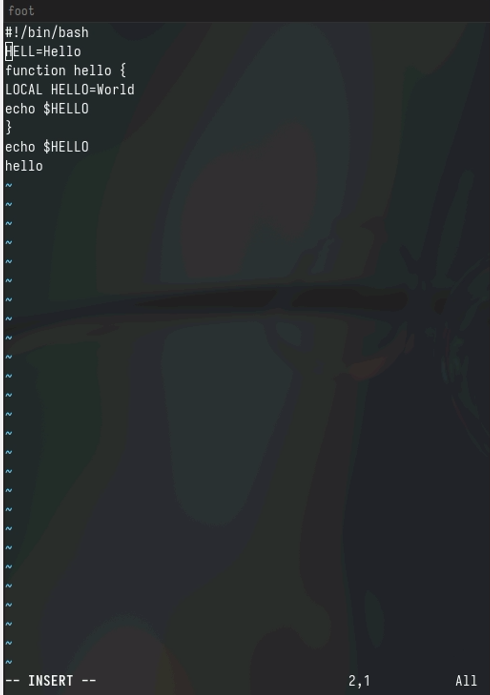{#fig:001 width=70%}

4. Нажмите клавишу i и вводите следующий текст.

{#fig:001 width=70%}

5. Нажмите клавишу Esc для перехода в командный режим после завершения ввода текста.

{#fig:001 width=70%}

6. Нажмите : для перехода в режим последней строки и внизу вашего экрана появится приглашение в виде двоеточия.

{#fig:001 width=70%}

7. Нажмите w (записать) и q (выйти), а затем нажмите клавишу Enter для сохранения вашего текста и завершения работы.

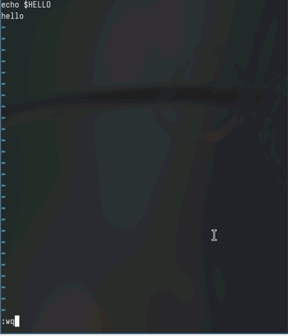{#fig:001 width=70%}

8. Сделайте файл исполняемым

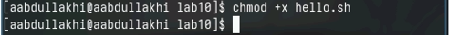{#fig:001 width=70%}

- Задание 2

1. Вызовите vi на редактирование файла

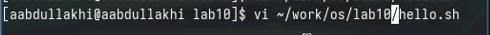{#fig:001 width=70%}

{#fig:001 width=70%}

2. Установите курсор в конец слова HELL второй строки.

{#fig:001 width=70%}

3. Перейдите в режим вставки и замените на HELLO. Нажмите Esc для возврата в командный режим

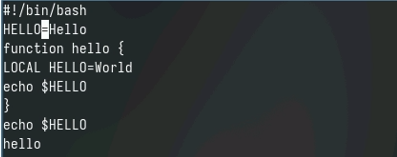{#fig:001 width=70%}

4. Установите курсор на четвертую строку и сотрите слово LOCAL.

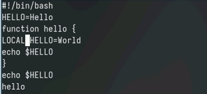{#fig:001 width=70%}

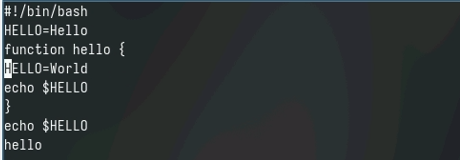{#fig:001 width=70%}

5. Перейдите в режим вставки и наберите следующий текст: local, нажмите Esc для возврата в командный режим.

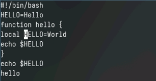{#fig:001 width=70%}

6. Установите курсор на последней строке файла. Вставьте после неё строку, содержащую следующий текст: echo $HELLO.

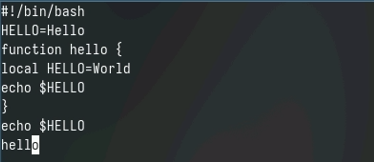{#fig:001 width=70%}

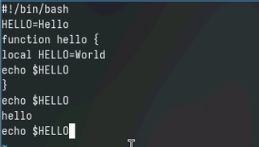{#fig:001 width=70%}

7. Нажмите Esc для перехода в командный режим.

8. Удалите последнюю строку.

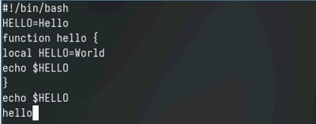{#fig:001 width=70%}

9. Введите команду отмены изменений u для отмены последней команды

{#fig:001 width=70%}

10. Введите символ : для перехода в режим последней строки. Запишите произведённые изменения и выйдите из vi.

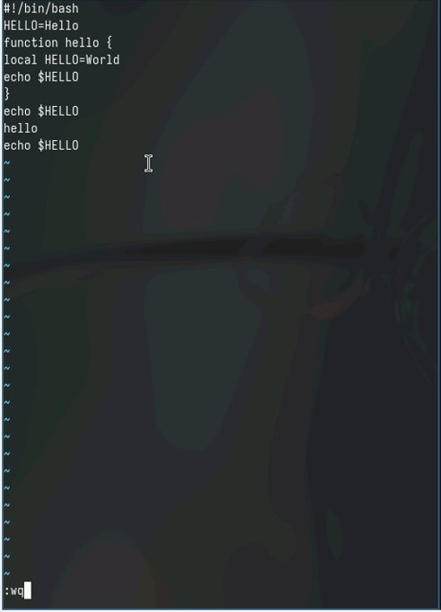{#fig:001 width=70%}

# Теоретическое введение

Здесь описываются теоретические аспекты, связанные с выполнением работы.

Например, в табл. [-@tbl:std-dir] приведено краткое описание стандартных каталогов Unix.

: Описание некоторых каталогов файловой системы GNU Linux {#tbl:std-dir}

| Имя каталога | Описание каталога                                                                                                          |
|--------------|----------------------------------------------------------------------------------------------------------------------------|
| `/`          | Корневая директория, содержащая всю файловую                                                                               |
| `/bin `      | Основные системные утилиты, необходимые как в однопользовательском режиме, так и при обычной работе всем пользователям     |
| `/etc`       | Общесистемные конфигурационные файлы и файлы конфигурации установленных программ                                           |
| `/home`      | Содержит домашние директории пользователей, которые, в свою очередь, содержат персональные настройки и данные пользователя |
| `/media`     | Точки монтирования для сменных носителей                                                                                   |
| `/root`      | Домашняя директория пользователя  `root`                                                                                   |
| `/tmp`       | Временные файлы                                                                                                            |
| `/usr`       | Вторичная иерархия для данных пользователя                                                                                 |

Более подробно про Unix см. в [@tanenbaum_book_modern-os_ru; @robbins_book_bash_en; @zarrelli_book_mastering-bash_en; @newham_book_learning-bash_en].

# Выполнение лабораторной работы

Описываются проведённые действия, в качестве иллюстрации даётся ссылка на иллюстрацию (рис. [-@fig:001]).

{#fig:001 width=70%}

# Выводы

Здесь кратко описываются итоги проделанной работы.

# Список литературы{.unnumbered}

::: {#refs}
:::
