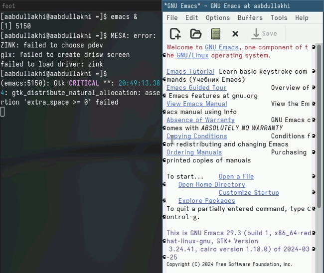
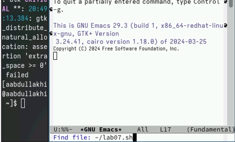
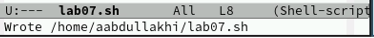
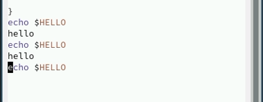
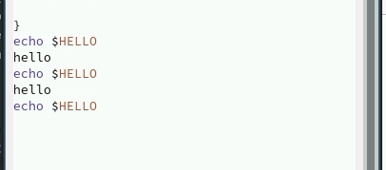
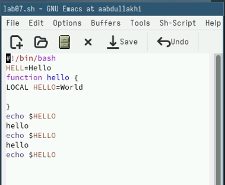
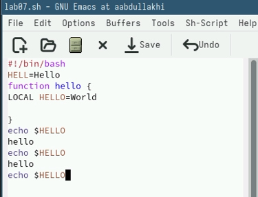
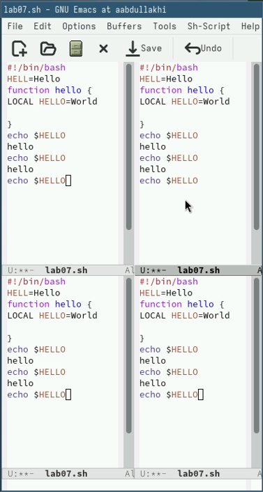
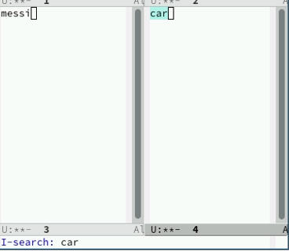

---
## Front matter
lang: ru-RU
title: лабораторная работа 11
author:
  - Абдуллахи Абдул Вахид
institute:
  - Российский университет дружбы народов, Москва, Россия
date: 19 Апреля 2024

## i18n babel
babel-lang: russian
babel-otherlangs: english
## Fonts
mainfont: PT Serif
romanfont: PT Serif
sansfont: PT Sans
monofont: PT Mono
mainfontoptions: Ligatures=TeX
romanfontoptions: Ligatures=TeX
sansfontoptions: Ligatures=TeX,Scale=MatchLowercase
monofontoptions: Scale=MatchLowercase,Scale=0.9
## Formatting pdf
toc: false
toc-title: Содержание
slide_level: 2
aspectratio: 169
section-titles: true
theme: metropolis
header-includes:
 - \metroset{progressbar=frametitle,sectionpage=progressbar,numbering=fraction}
 - '\makeatletter'
 - '\beamer@ignorenonframefalse'
 - '\makeatother'
---

## Цель работы

- Познакомиться с операционной системой Linux. Получить практические навыки работы с редактором Emacs.

## Задание

1. Ознакомиться с теоретическим материалом.

2. Ознакомиться с редактором emacs.

3. Выполнить упражнения.

4. Ответить на контрольные вопросы.

## Открыть emacs

## Создать файл lab07.sh

## охранить файл с помощью комбинации Ctrl-x Ctrl-s (C-x C-s)

## Переместите курсор в начало строки (C-a)

## Переместите курсор в конец строки (C-e)

## Переместите курсор в начало буфера (M-<)

## Переместите курсор в конец буфера

## Поделите фрейм на 4 части

## Режим поиска

# спасибо за внимание

